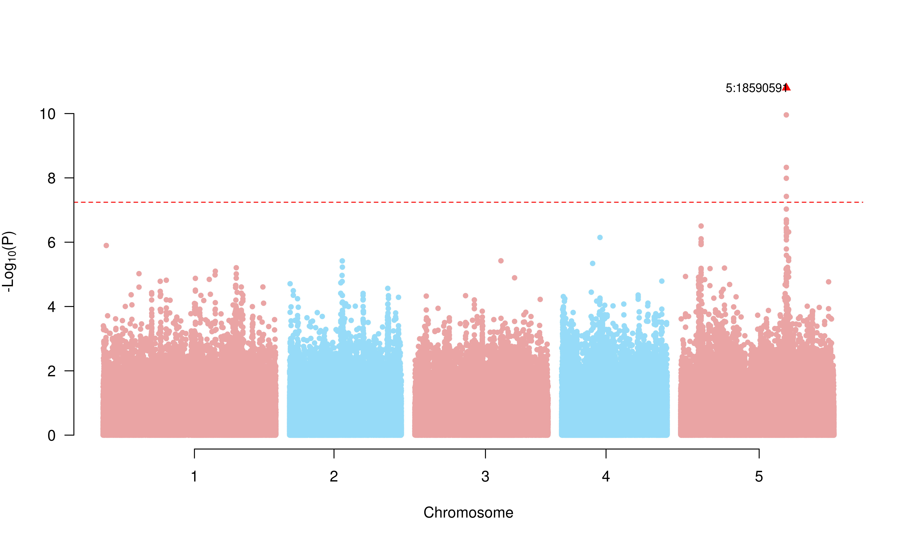

### Analysis Process

- Uses GCTA to conduct a mixed linear model association analysis for each SNP and phenotype. 
- If the inflation factor is bigger than 1.1, lambda adjusted p value will be used. 
- If "Show Top SNPs" is selected, EasyOmics extracts and merges SNPs based on their significance, physical distance, and Linkage Disequilibrium (LD),  and annotates the most significant independent SNPs on the Manhattan plot.

### Input and Output

> Input Parameters

|Parameter|Description|
|--|--|
|Upload Phenotype Data File|The phenotype data, format is shown in "Data Preparation".|
|Upload VCF Data File|The VCF data, format is shown in "Data Preparation".|
|Select a model|The model used for the association analysis. Mixed linear model is the default and most commonly used.|
|Threshold|  A value setting the significance threshold (P-value) for GWAS analysis. SNPs with P-values below this threshold are retained. Supports numeric input, defaulting to 5e-8. For users unsure of the significance threshold, entering "Bonferroni" sets it to 0.05 divided by the number of SNPs.|
|Color|Sets adjacent chromosome colors in the Manhattan plot. Hexadecimal colors are connected by "_"|
|Show Top SNPs|Whether to show the top SNPs in the Manhattan plot.|
|Other Parameters|Other parameters of the main invoked software for this analysis.|

> Output Results

|Filename|Description|
|--|--|
|Time_phename_mlm.log&mlma|The output of the invoked software for the association analysis.|
|Time_phenamemanhattan.pdf&png|The visualized results of the association analysis. Includes a Manhattan plot of the association results.|
|Time_phenametop_snps.txt|The association result of the top SNPs.|
|Time_pheqqplot.pdf&png|The visualized results of the association analysis. Includes a QQ plot of the association results and a regression line of inflation factor.|
|Time_phenamemanhattan_corrected.pdf&png|If the inflation factor is bigger than 1.1, the p value of SNPs will be adjusted and visualized in this plot.|
|Time_phenametop_snps_corrected.txt|The top SNPs after p value adjustment.|

### Main Results Interpretation

- Manhattan plot.
  

- QQ plot.

- The p-value: p-value means the significance of association between genetic variation and phenotype. If some SNPs pass the threshold,  these SNPs are statistically significant association between the genetic variant and the trait.
- The inflation factor: The inflation factor λ is typically calculated as the median of the observed chi-squared test statistics divided by the median of the theoretical chi-squared distribution under the null hypothesis. When λ is significantly greater than 1.1, suggests an overdispersion of test statistics, which may be due to population stratification, cryptic relatedness among samples, or other forms of systematic bias.